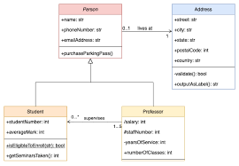

# les4-b
Les over README en markdown

## deze les

la la la deze les

### minder belangrijk


Ik ben **Jelle**, leraar gamedev

> “Life is like riding a bicycle. To keep your balance, you must keep moving.
>-- Albert Einstein

[Mijn website](https://sjo.hosts1.ma-cloud.nl/wiskundePortfolio2017/)

<j.sjollema@ma-web.nl>



1. Beginnen
2. verder gaan
   1. pas nadat je begonnen bent
   2. nu kan je verder gaan
3. bijna klaar
4. klaar

* opletten
* brood meenemen
  * of crackers
  * of yoghurt
* studentenpas niet vergeten

```` cs
for(int i = 0; i< 10 ; i++>){
    doWat();
}
````
